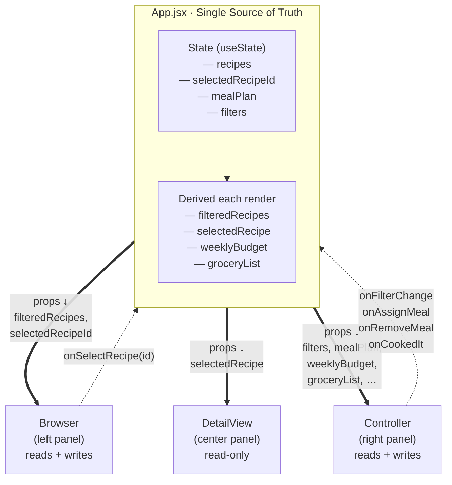
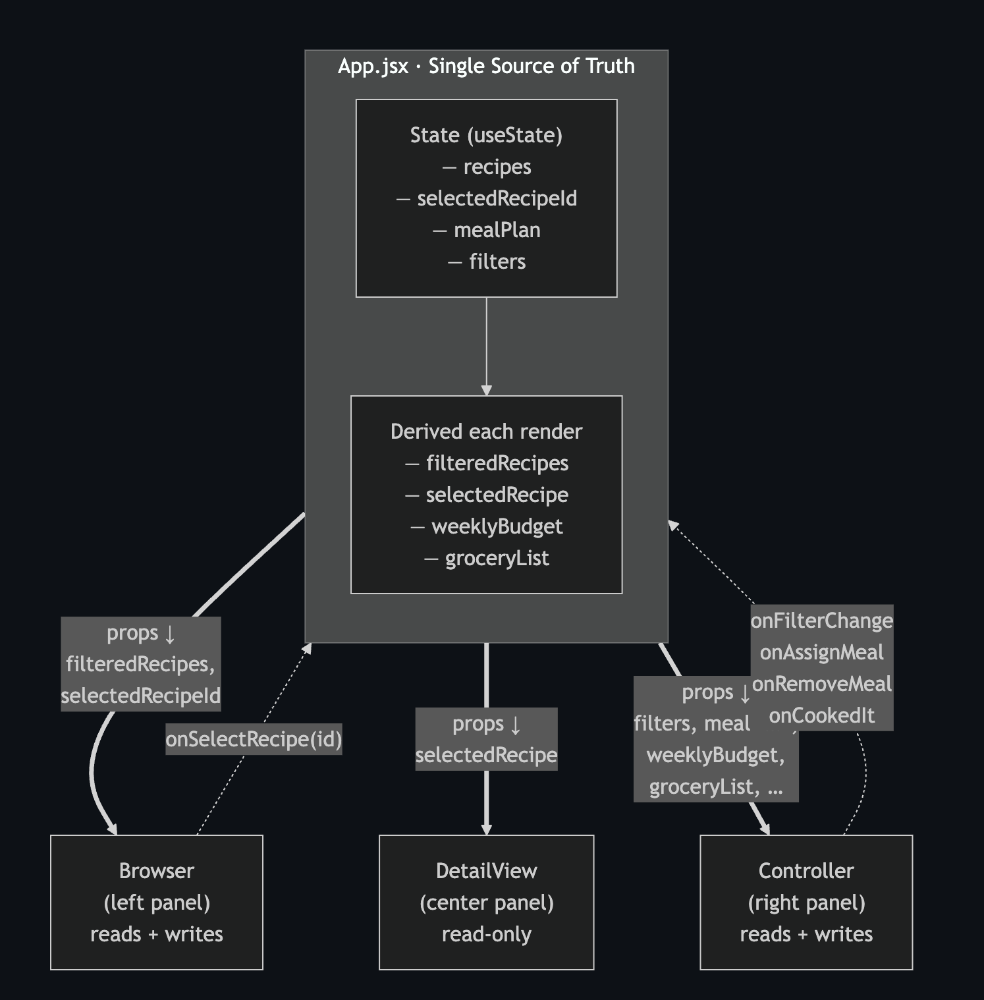
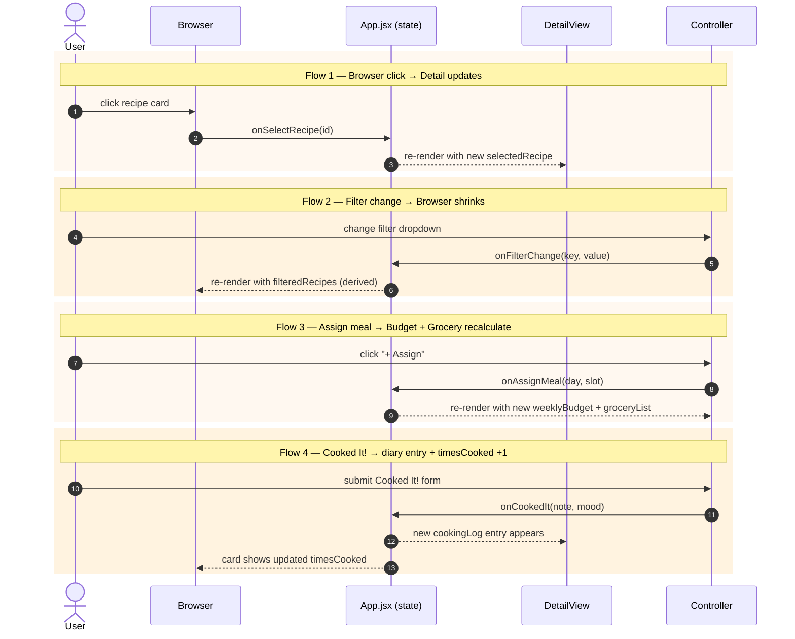
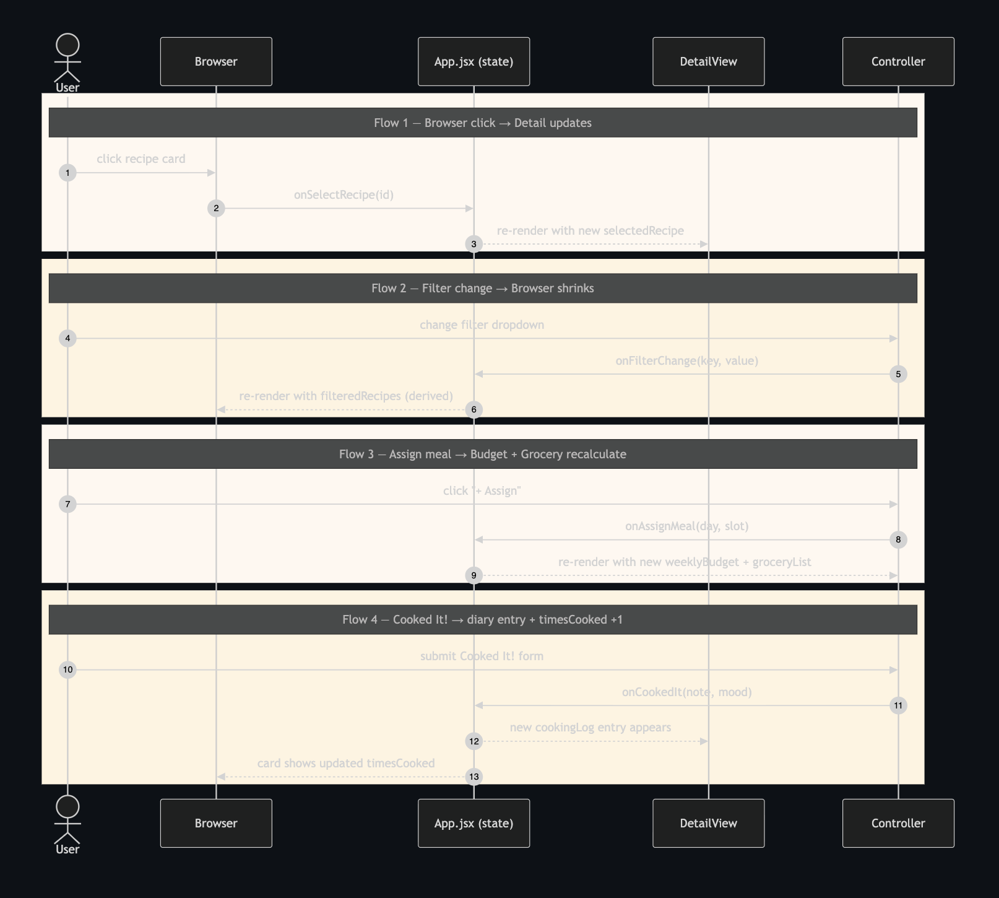

# Cooked It!

AI 201 — Project 2: The Reactive Sandbox
A weekly meal planner + cooking diary for solo-living young adults.

🔗 **Live demo**: https://chanhwi-keyoh.github.io/Cookit-/
📐 **Design Intent**: [design-intent.md](design-intent.md)
🗺 **System diagrams**: [Architecture (Mermaid)](#architecture) · [State flows (Mermaid)](#what-triggers-updates--the-4-state-flows) · [PNG: architecture](docs/diagrams/architecture.png) · [PNG: state flows](docs/diagrams/state-flows.png)
📓 **AI Direction Log**: [in this README](#ai-direction-log) · [standalone copy](docs/ai-direction-log.md)
✋ **Records of Resistance**: [in this README](#records-of-resistance) · [standalone copy](docs/records-of-resistance.md)

## Run it locally

```bash
npm install
npm run dev
```

Open http://localhost:5173.

## Architecture

State lives in **one place** — `App.jsx`. The three panels are presentational: they receive data as props (solid lines) and send change requests up as callbacks (dashed lines).



📎 **Static PNG**: [docs/diagrams/architecture.png](docs/diagrams/architecture.png)



No child component holds its own copy of `selectedRecipeId`, `recipes`, `mealPlan`, or `filters`. Derived values are recomputed each render — never stored. See [src/App.jsx](src/App.jsx) for the four `useState` calls and the derivation logic.

## What triggers updates — the 4 state flows



📎 **Static PNG**: [docs/diagrams/state-flows.png](docs/diagrams/state-flows.png)



### How each flow updates state (mechanism)

The diagram above shows *who calls what*. The mechanism behind each flow:

1. **Browser click → Detail updates** — clicking a card sets `selectedRecipeId`; `selectedRecipe` is derived from `recipes.find(r => r.id === selectedRecipeId)` each render.
2. **Filter change → Browser shrinks** — Controller writes `filters`; `filteredRecipes` is derived from `recipes.filter(matchesFilters)` and passed to Browser as a prop.
3. **Assign meal → Budget + Grocery recalculate** — Controller writes to `mealPlan`; `weeklyBudget` and `groceryList` are recomputed from `mealPlan` + `recipes` each render. No cached totals.
4. **"Cooked It!" → diary entry + timesCooked +1** — App immutably maps over `recipes` and updates the one whose id matches `selectedRecipeId`, prepending to `cookingLog` and incrementing `timesCooked`.

## Tech

- Vite + React 18 (JavaScript — no TypeScript)
- `useState` + props only. **No `useContext`, no Redux.** The component tree is 2 levels deep; lifting state to `App` is sufficient.
- Plain CSS, one file per component.
- Initial data hardcoded in [src/data/recipes.js](src/data/recipes.js). No backend, no fetch, no localStorage.

## File map

```
src/
├── App.jsx                  ← all state + callbacks + layout
├── App.css
├── index.css                ← palette variables, base styles
├── main.jsx
├── data/
│   └── recipes.js           ← 10 seed recipes + initial mealPlan/filters
└── components/
    ├── Browser.jsx          ← card grid, reads filteredRecipes
    ├── Browser.css
    ├── DetailView.jsx       ← recipe + cooking diary, read-only
    ├── DetailView.css
    ├── Controller.jsx       ← filters, meal plan, Cooked It! form
    └── Controller.css
```

## Five Questions

### 1. Can I defend this?
Yes. Every major decision traces back to one idea: state lives in `App.jsx`, nowhere else. `recipes`, `selectedRecipeId`, `mealPlan`, and `filters` are the four state atoms. Everything downstream — filtered cards, weekly budget, grocery list — is *derived*, not stored. Components talk to `App` through props (down) and callback functions (up). I can point to every `useState` call in the app (there are five, four in `App.jsx` and one for the Cooked It! form draft) and justify why each one exists.

### 2. Is this mine?
The Design Intent drove every decision that shaped the system: the domain (solo cook's weekly planner), the Browser/Detail/Controller split, the recipe notebook visual mood, the data shape, the four state flows, the "Cooked It!" button as the emotional center. I wrote that doc before Claude touched any code. Claude wrote code *against* the spec; I didn't generate the spec *against* Claude's code.

### 3. Did I verify?
Yes. I walked the four required flows in the running app:
- Click any card in Browser → Detail View swaps to that recipe.
- Set "Under 15 min" filter → Browser shrinks from 30 → recipes matching.
- Assign a recipe to a day/slot → Weekly Budget goes up by its cost, Grocery List absorbs its ingredients.
- Submit Cooked It! → a new dated entry appears at the top of the diary, `timesCooked` increments on the Browser card.

The single-source-of-truth check: open React DevTools on `App`. All four state atoms are visible there. `Browser` and `DetailView` hold no state. `Controller` holds only draft-form state (`note`, `mood`) that enters shared state on submit — not a duplicate of anything.

### 4. Would I teach this?
Yes. The elevator version: *"If two components need the same data, move the data to the nearest parent they share. The parent holds it with `useState`, passes it to the children as props, and the children ask for changes by calling functions the parent gave them."* In this app, that parent is `App`. The data flows one direction (down), the change requests flow the other direction (up). Nothing loops back on itself — that's why the app stays predictable.

### 5. Is my documentation honest?
Yes. The [AI Direction Log](#ai-direction-log) below records five real decisions I made during the build. The [Records of Resistance](#records-of-resistance) section documents four actual moments where I said "no" to what Claude produced — storing `filteredRecipes`, reaching for `useContext`, styling before the wiring was proven, and a too-conservative grocery-list merge. Neither section is a reconstruction; they describe the session as it happened.

---

## AI Direction Log

Editorial notes on how I worked with Claude to build this app.
These are the decisions *I* made; Claude wrote the code against them.

### Entry 1 — Locking the stack and pinning the state architecture

Before I let Claude generate anything, I made it stop and answer two questions I'd already decided: (1) what framework/tooling, and (2) how state is owned.

**Stack (locked first):** Vite + React with **JavaScript** (not TypeScript, not Next.js) and **hardcoded data in `src/data/recipes.js`** (not `fetch`, not localStorage). The reasoning is pedagogical, not technical. The assignment is about lifting state and the props-down/events-up pattern. TypeScript would add a second thing to think about. `fetch` would bring loading states and async timing into the architecture discussion. localStorage would hide state mutations I need to see. Every layer I stripped away made the React state pattern more visible — which is the whole thing I'm supposed to be learning.

**State architecture (locked second, as a hard rule):** `recipes`, `selectedRecipeId`, `mealPlan`, and `filters` live as four `useState` calls in `App.jsx`, and **nothing else holds persistent state**. I also told Claude what the *derived* values had to be: `filteredRecipes`, `selectedRecipe`, `weeklyBudget`, `groceryList` — all computed each render from the four atoms above, never stored.

Stating both of these up front saved a lot of back-and-forth. Claude didn't have to guess what the architecture should look like; it just had to write code that honored it.

### Entry 2 — Building one component at a time, in a specific order

Claude's first instinct was to generate all three panels at once. I made it follow this order:

1. `src/data/recipes.js` (data first, so everything downstream has a target)
2. `App.jsx` shell (the state container and empty panels)
3. `Browser` (card grid, proved selection wiring)
4. `DetailView` (proved Browser → Detail interaction)
5. `Controller — Filters` (proved Controller → Browser interaction)
6. `Controller — Meal Plan` (proved budget + grocery derivation)
7. `Controller — "Cooked It!" form` (proved the full state-mutation loop)
8. Visual styling

After each step I clicked around and verified the state flow worked before moving on. The course brief explicitly says "test the wiring before the styling" and I held that line.

### Entry 3 — Refusing `useContext` and Redux before they came up

The course brief names "useContext/Redux too early" as a common AI failure mode. So I preempted it. In the plan I gave Claude, I wrote: *"useState + props only. No useContext, no Redux, no Zustand."*

The component tree is two levels deep (`App` → `Browser`/`DetailView`/`Controller`). Props work. The fact that the `Controller` now takes nine props (four state slices, four callbacks, one derived object) looks heavy but is honest — every prop is a wire the assignment wants me to see. Context would hide them.

### Entry 4 — Expanding the recipe library as pure data entry

After the base app was working, my instructor-supplied `additional-recipes.md` added 20 more recipes (r-11 through r-30). I had Claude convert the markdown tables and step lists into JS objects matching the schema of recipes 1–10.

This was deliberate in how I scoped it: no new components, no new state, no new UI. Just data. The app absorbed the 20 new records with zero architectural change — which I took as a quiet proof that the state shape I defined up front was the right one. If adding data forces changes to components, the data model is wrong.

### Entry 5 — Post-deploy refinements: images, prices, copy

After the app was live, three small changes came up across separate sessions. I'm collapsing them into one entry because they all share the same shape: **the architecture didn't move, only data and labels did.**

**Images.** I generated 30 PNGs (one per recipe) and dropped them in a `png/` folder, filenames matching recipe names exactly. I asked Claude to wire them into Browser thumbnails and DetailView hero. Two decisions I made that Claude would not have made by default: (1) **no `image` field on each recipe** — derive the URL from `recipe.name` at render time, so renaming a recipe never desyncs from a third place; (2) put PNGs in `public/images/recipes/` with `import.meta.env.BASE_URL`, **not** Vite's `import.meta.glob`. Glob would have hashed the filenames. Public keeps them readable in DevTools and works under the GitHub Pages subpath.

**Prices.** The original cost values ($1.00–$5.00) read as 2015 pricing. I gave Claude two options: write a unit-price table and recompute every recipe, or just hand-adjust. I picked hand-adjust. A unit-price table would have been fake precision — grocery prices vary by region/store/week and I can't hand-verify a $/g value Claude invents. New range $2.00–$7.00 per serving. I also shifted the Max Cost filter from `Under $3 / Under $5` to `Under $4 / Under $6`, because under the new range "Under $5" was "almost everything," and a filter that doesn't filter is wrong.

**Copy.** A classmate playtesting asked, "Is this the list for the recipe I'm looking at?" — pointing at the Grocery List section. It wasn't. It's the merged list across the whole week's meal plan. I changed `Grocery List` → `Weekly Grocery List`. One Edit call. The other option was to split the section into a per-recipe list inside DetailView and a weekly list inside Controller — which would have created a second state flow I didn't need. The lesson I want logged: when a tester is confused, check whether the **label is lying about scope** before reaching for a component split.

All three changes were data-only or copy-only. The wire diagram from Entry 1 is unchanged.

---

## Records of Resistance

Four moments where I rejected or significantly revised what Claude produced. The course calls these "opportunities, not mistakes." Documenting them honestly.

### Resistance 1 — Refusing to store `filteredRecipes` as state

**What Claude reached for:** When wiring up the filter controls, there was a natural path where `filteredRecipes` becomes its own `useState` and every filter-change callback has to remember to recompute it.

**Why I rejected it:** That's two sources of truth. The "truth" about which recipes match the filter is a pure function of `recipes` and `filters` — no extra information exists. Storing it would mean every `onFilterChange` has to update two things, and if one update path is ever added without the other, the lists silently drift apart. This is the exact "duplicated state" failure mode the course calls out as #1.

**What I did instead:** `filteredRecipes` is computed inline in `App.jsx` every render:

```js
const filteredRecipes = recipes.filter((r) => matchesFilters(r, filters));
```

No storage, no drift. Same pattern applied to `selectedRecipe`, `weeklyBudget`, and `groceryList`.

### Resistance 2 — No `useContext` despite a long prop list

**What Claude (and the prop list) tempted me toward:** `Controller` now takes nine props:

```js
filters, mealPlan, recipes, selectedRecipeId, selectedRecipe,
weeklyBudget, groceryList,
onFilterChange, onAssignMeal, onRemoveMeal, onCookedIt
```

That's visually heavy. The idiomatic React move when a prop list swells is to wrap the subtree in a Context provider. Claude didn't suggest it outright but the shape of the code asks for it.

**Why I rejected it:** The component tree is *two levels deep*. App → Controller. There is no intermediate component that would otherwise have to pass these props through. Context here would not eliminate prop drilling; it would hide an API that's supposed to be visible. The course brief is explicit: "useContext/Redux too early" is an AI failure mode.

**What I did instead:** Kept the full prop list. Every wire shows, which is the whole pedagogical point. When I can defend every prop in `Controller`'s signature, I've demonstrated I understand what the component depends on — which Context would let me fudge.

### Resistance 3 — Styling last, not first

**What Claude wanted to do:** Early in component generation, Claude produced cards and panels with fairly elaborate CSS (shadows, hover states, tag badges, typography) in the same commit as the initial render logic. It's the path of least resistance for an LLM — text output is cheap and CSS makes things look done.

**Why I rejected it:** The course brief is direct about this: *"Test the wiring before the styling. [...] If yes, then add visual polish. If no, the architecture is broken and no amount of CSS will fix it."* Pretty CSS on broken state management is exactly the artifact ESF is trying to prevent.

**What I did instead:** Ripped the visual flourishes out of early components and held them until step 9 of my build plan, after all four state flows were verified working. When I did apply styling, I knew the app worked; the palette, washi-tape diary accent, rounded cards, and notebook-paper lines were decisions about *presentation*, not *function*. If I'd styled first, every design decision would have been contaminated by "does this still work?" anxiety.

### Resistance 4 — Making the Grocery List actually merge

**What Claude shipped:** The first version of `mergeIngredients` keyed each line by `` `${name}::${unit}` ``. If I assigned two recipes that both used sugar — one calling for 2 tbsp, the other for 2 tsp — the grocery list rendered two separate rows:

```
Sugar    2 tbsp
Sugar    2 tsp
```

Technically correct, because tbsp ≠ tsp. Practically useless: the whole point of a grocery list is "how much of X do I need to buy," and "X" for the shopper is *sugar*, not *sugar-in-tablespoons* and *sugar-in-teaspoons*.

**Why I rejected it:** The merge was too conservative. It let the data model (where unit is a peer of name) drive the UX, when the UX should drive how data is grouped for display. A reasonable shopper reads "Sugar" as one line and figures out the scoops themselves — they don't want to scan the list twice for the same ingredient.

**Why I also rejected the tempting overreach:** my first instinct was to have Claude write a unit-conversion table (1 tbsp = 3 tsp, etc.) and sum everything into a single quantity. I talked myself out of it. Unit conversion is a whole can of worms — volumes vs. weights, ingredient density, locale (US tbsp ≠ metric tbsp). A wrong conversion in a cooking app is worse than no conversion. I don't trust an AI-generated conversion table I can't hand-verify, and this project isn't the place to fight that fight.

**What I did instead:** Group by ingredient *name* (case- and whitespace-normalized), but within each group keep the units as separate sub-amounts joined by `+`:

```
Sugar    2 tbsp + 2 tsp
```

One row per ingredient, mixed units preserved verbatim. No fake conversions, no duplicated rows. In `App.jsx`, `mergeIngredients` now returns `{ name, amounts: [{ qty, unit }] }` instead of flat `{ name, qty, unit }`, and `Controller.jsx` joins the amounts with `" + "` at render time. The state architecture didn't change — this was a fix in the pure-derived-value layer, which is exactly where display concerns belong.

---

## ESF Checklist

- [x] Design Intent written — see [design-intent.md](design-intent.md)
- [x] Mermaid diagrams in repo — [Architecture](#architecture) and [State flows](#what-triggers-updates--the-4-state-flows) (this README); PNG copies in [docs/diagrams/](docs/diagrams/)
- [x] AI Direction Log — 5 entries: [in this README](#ai-direction-log) (standalone copy: [docs/ai-direction-log.md](docs/ai-direction-log.md))
- [x] Records of Resistance — 4 entries: [in this README](#records-of-resistance) (standalone copy: [docs/records-of-resistance.md](docs/records-of-resistance.md))
- [x] Five Questions answered (this README)
- [x] Git commits before/after AI sessions

---

Built April 2026 for AI 201, Professor Tim Lindsey, SCAD.
