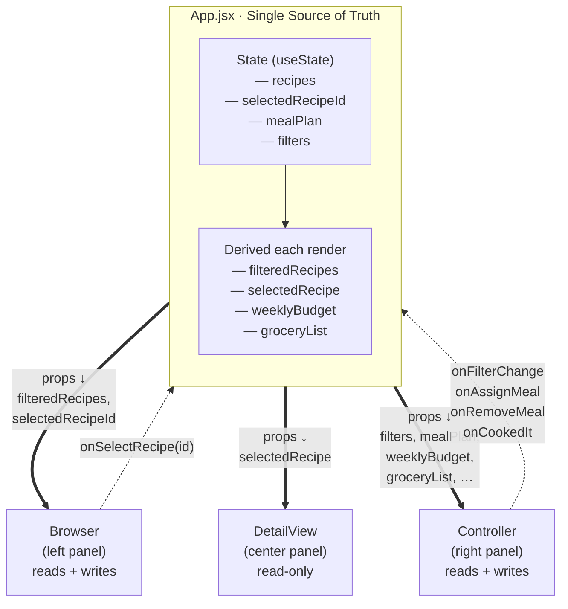
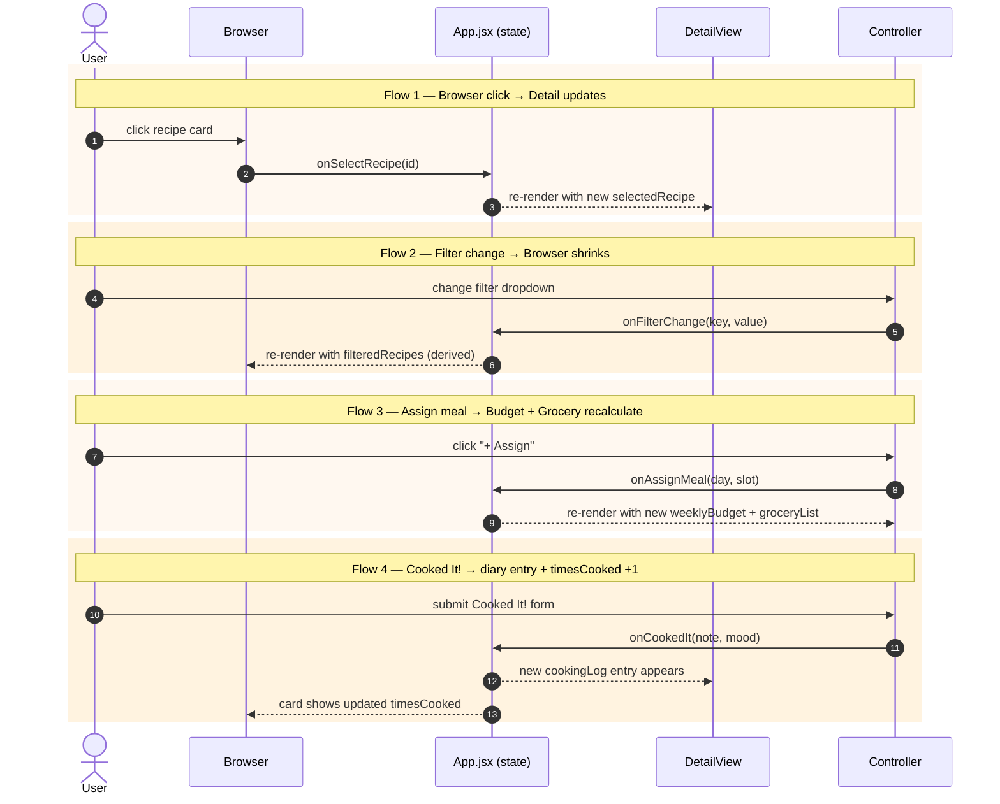

# Cooked It!

AI 201 — Project 2: The Reactive Sandbox
A weekly meal planner + cooking diary for solo-living young adults.

🔗 **Live demo**: https://chanhwi-keyoh.github.io/Cookit-/
📐 **Design Intent**: [design-intent.md](design-intent.md)
🗺 **System diagrams**: [Architecture (Mermaid)](#architecture) · [State flows (Mermaid)](#what-triggers-updates--the-4-state-flows) · [PNG: architecture](docs/diagrams/architecture.png) · [PNG: state flows](docs/diagrams/state-flows.png)
📓 **AI Direction Log**: [docs/ai-direction-log.md](docs/ai-direction-log.md)
✋ **Records of Resistance**: [docs/records-of-resistance.md](docs/records-of-resistance.md)

## Run it locally

```bash
npm install
npm run dev
```

Open http://localhost:5173.

## Architecture

State lives in **one place** — `App.jsx`. The three panels are presentational: they receive data as props (solid lines) and send change requests up as callbacks (dashed lines).



📎 **Static PNG**: [docs/diagrams/architecture.png](docs/diagrams/architecture.png)


No child component holds its own copy of `selectedRecipeId`, `recipes`, `mealPlan`, or `filters`. Derived values are recomputed each render — never stored. See [src/App.jsx](src/App.jsx) for the four `useState` calls and the derivation logic.

## What triggers updates — the 4 state flows



📎 **Static PNG**: [docs/diagrams/state-flows.png](docs/diagrams/state-flows.png)


### How each flow updates state (mechanism)

The diagram above shows *who calls what*. The mechanism behind each flow:

1. **Browser click → Detail updates** — clicking a card sets `selectedRecipeId`; `selectedRecipe` is derived from `recipes.find(r => r.id === selectedRecipeId)` each render.
2. **Filter change → Browser shrinks** — Controller writes `filters`; `filteredRecipes` is derived from `recipes.filter(matchesFilters)` and passed to Browser as a prop.
3. **Assign meal → Budget + Grocery recalculate** — Controller writes to `mealPlan`; `weeklyBudget` and `groceryList` are recomputed from `mealPlan` + `recipes` each render. No cached totals.
4. **"Cooked It!" → diary entry + timesCooked +1** — App immutably maps over `recipes` and updates the one whose id matches `selectedRecipeId`, prepending to `cookingLog` and incrementing `timesCooked`.

## Tech

- Vite + React 18 (JavaScript — no TypeScript)
- `useState` + props only. **No `useContext`, no Redux.** The component tree is 2 levels deep; lifting state to `App` is sufficient.
- Plain CSS, one file per component.
- Initial data hardcoded in [src/data/recipes.js](src/data/recipes.js). No backend, no fetch, no localStorage.

## File map

```
src/
├── App.jsx                  ← all state + callbacks + layout
├── App.css
├── index.css                ← palette variables, base styles
├── main.jsx
├── data/
│   └── recipes.js           ← 10 seed recipes + initial mealPlan/filters
└── components/
    ├── Browser.jsx          ← card grid, reads filteredRecipes
    ├── Browser.css
    ├── DetailView.jsx       ← recipe + cooking diary, read-only
    ├── DetailView.css
    ├── Controller.jsx       ← filters, meal plan, Cooked It! form
    └── Controller.css
```

## Five Questions

### 1. Can I defend this?
Yes. Every major decision traces back to one idea: state lives in `App.jsx`, nowhere else. `recipes`, `selectedRecipeId`, `mealPlan`, and `filters` are the four state atoms. Everything downstream — filtered cards, weekly budget, grocery list — is *derived*, not stored. Components talk to `App` through props (down) and callback functions (up). I can point to every `useState` call in the app (there are five, four in `App.jsx` and one for the Cooked It! form draft) and justify why each one exists.

### 2. Is this mine?
The Design Intent drove every decision that shaped the system: the domain (solo cook's weekly planner), the Browser/Detail/Controller split, the recipe notebook visual mood, the data shape, the four state flows, the "Cooked It!" button as the emotional center. I wrote that doc before Claude touched any code. Claude wrote code *against* the spec; I didn't generate the spec *against* Claude's code.

### 3. Did I verify?
Yes. I walked the four required flows in the running app:
- Click any card in Browser → Detail View swaps to that recipe.
- Set "Under 15 min" filter → Browser shrinks from 30 → recipes matching.
- Assign a recipe to a day/slot → Weekly Budget goes up by its cost, Grocery List absorbs its ingredients.
- Submit Cooked It! → a new dated entry appears at the top of the diary, `timesCooked` increments on the Browser card.

The single-source-of-truth check: open React DevTools on `App`. All four state atoms are visible there. `Browser` and `DetailView` hold no state. `Controller` holds only draft-form state (`note`, `mood`) that enters shared state on submit — not a duplicate of anything.

### 4. Would I teach this?
Yes. The elevator version: *"If two components need the same data, move the data to the nearest parent they share. The parent holds it with `useState`, passes it to the children as props, and the children ask for changes by calling functions the parent gave them."* In this app, that parent is `App`. The data flows one direction (down), the change requests flow the other direction (up). Nothing loops back on itself — that's why the app stays predictable.

### 5. Is my documentation honest?
Yes. The [AI Direction Log](docs/ai-direction-log.md) records five real decisions I made during the build. The [Records of Resistance](docs/records-of-resistance.md) documents four actual moments where I said "no" to what Claude produced — storing `filteredRecipes`, reaching for `useContext`, styling before the wiring was proven, and a too-conservative grocery-list merge. Neither document is a reconstruction; they describe the session as it happened.

## ESF Checklist

- [x] Design Intent written — see [design-intent.md](design-intent.md)
- [x] Mermaid diagrams in repo — [Architecture](#architecture) and [State flows](#what-triggers-updates--the-4-state-flows) (this README); PNG copies in [docs/diagrams/](docs/diagrams/)
- [x] AI Direction Log — 5 entries: [docs/ai-direction-log.md](docs/ai-direction-log.md)
- [x] Records of Resistance — 4 entries: [docs/records-of-resistance.md](docs/records-of-resistance.md)
- [x] Five Questions answered (this README)
- [x] Git commits before/after AI sessions

---

Built April 2026 for AI 201, Professor Tim Lindsey, SCAD.
